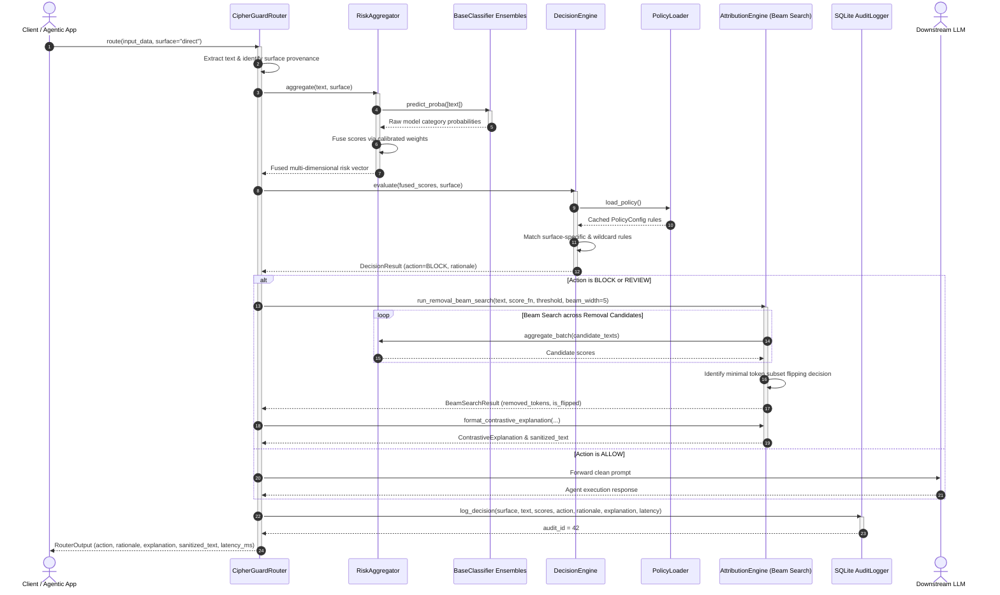
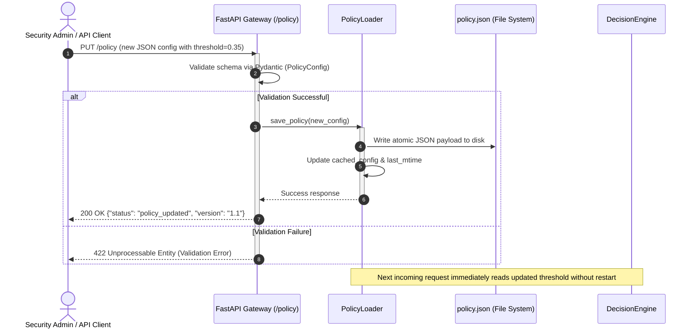
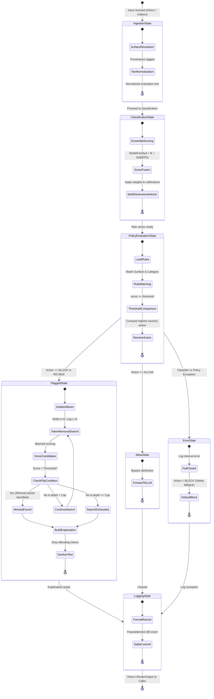

# System Design & UML Specification
## CipherGuard: A Policy-Aware Safety Router with Removal-Based Token Attribution for LLM Applications

**Institution:** Keshav Memorial Institute of Technology (KMIT), Hyderabad  
**Department:** Computer Science & Engineering  
**Project Guide:** B. Shailesh  
**Project Team:** Shreya Namdeo, Shashank Reddy Yasa, Adi Aswatha Reddy, B. Abhinav  
**Version:** 1.0.0  
**Date:** September 2026  

---

## 1. Executive System Design Overview

CipherGuard is engineered as an inline, low-latency pre-agent security gateway. It decouples high-dimensional threat classification from operational security policies, enabling zero-retraining runtime adaptability alongside transparent token-level auditability.

### 1.1 Architectural Pattern & Principles
1. **Gateway Pattern:** Intercepts all incoming queries (both direct user prompts and indirect ingested content) before they touch expensive downstream generative agents.
2. **Layered Pipeline Architecture:** Decomposes request lifecycle into discrete, isolated stages: *Ingestion $\rightarrow$ Classification $\rightarrow$ Policy Evaluation $\rightarrow$ Attribution (Conditional) $\rightarrow$ Audit Logging*.
3. **Decoupled Strategy Pattern:** Abstract classifier interfaces (`BaseClassifier`) allow hot-swapping or ensembling multiple discriminative backends (lexical, neural MLP, transformer-based DeBERTa-v3) without impacting policy logic.
4. **Hot-Reload Repository:** Runtime file-watcher and memory cache for the policy matrix, ensuring atomic threshold updates without restart.

---

## 2. Subsystem Decomposition

```
┌─────────────────────────────────────────────────────────────────────────────┐
│                          CipherGuard Pre-Agent Gateway                       │
├───────────────────┬───────────────────┬───────────────────┬─────────────────┤
│ 1. Ingestion Layer│ 2. Classification │ 3. Dynamic Policy │ 4. Attribution  │
│                   │    & Aggregation  │    Decision Engine│    Search Engine│
├───────────────────┼───────────────────┼───────────────────┼─────────────────┤
│ • DirectInput     │ • ModelFamilyA    │ • PolicySchema    │ • Beam Search   │
│   (User prompts)  │   (TF-IDF+LogReg) │ • PolicyLoader    │ • Delta Scorer  │
│ • IndirectInput   │ • ModelFamilyB    │   (Hot-reload)    │ • Contrastive   │
│   (Docs, Tools,   │   (Dense+MLP)     │ • DecisionEngine  │   Explainer     │
│    Emails, Chunks)│ • DeBERTa-v3      │   (Rule resolver) │ • Content       │
│ • Surface Tagging │ • RiskAggregator  │ • Multi-Surface   │   Sanitizer     │
│                   │   (Score Fusion)  │   Threshold Logic │                 │
└───────────────────┴───────────────────┴───────────────────┴─────────────────┘
                                       │
                                       ▼
                     ┌────────────────────────────────────┐
                     │   5. Persistence & Interface       │
                     │  • SQLite AuditLogger Store        │
                     │  • FastAPI REST Server (port 8000) │
                     │  • Streamlit Dashboard (port 8501) │
                     └────────────────────────────────────┘
```

---

## 3. Class Diagram

The following UML Class Diagram details the object-oriented structure, class members, type signatures, and design relationships (inheritance, realization, composition, and dependency) across the CipherGuard framework.

```mermaid
classDiagram
    %% Ingestion Layer
    class DirectInput {
        +str text
        +str surface = "direct"
        +get_eval_text() str
    }

    class IndirectSourceType {
        <<enumeration>>
        RETRIEVED_DOC
        TOOL_OUTPUT
        EMAIL
        API_RESPONSE
        WEB_PAGE
    }

    class IndirectInput {
        +str content
        +IndirectSourceType source_type
        +dict metadata
        +str surface = "indirect"
        +get_eval_text() str
    }

    %% Classification Layer
    class BaseClassifier {
        <<abstract>>
        +predict_proba(texts: List~str~) List~Dict~str, float~~*
    }

    class ModelFamilyA {
        -TfidfVectorizer vectorizer
        -LogisticRegression classifier
        +predict_proba(texts: List~str~) List~Dict~str, float~~
        +train(texts: List~str~, labels: List~int~) void
    }

    class ModelFamilyB {
        -SentenceTransformer encoder
        -MLPClassifier classifier
        +predict_proba(texts: List~str~) List~Dict~str, float~~
        +train(texts: List~str~, labels: List~int~) void
    }

    class DebertaClassifier {
        -AutoTokenizer tokenizer
        -AutoModelForSequenceClassification model
        +predict_proba(texts: List~str~) List~Dict~str, float~~
    }

    class RiskAggregator {
        -List~BaseClassifier~ models
        -Dict~str, float~ weights
        +aggregate(text: str, surface: str) Dict~str, Any~
        +aggregate_batch(texts: List~str~, surfaces: List~str~) List~Dict~str, Any~~
    }

    BaseClassifier <|-- ModelFamilyA
    BaseClassifier <|-- ModelFamilyB
    BaseClassifier <|-- DebertaClassifier
    RiskAggregator o-- BaseClassifier : aggregates

    %% Policy & Decision Layer
    class RoutingAction {
        <<enumeration>>
        ALLOW
        REVIEW
        BLOCK
    }

    class PolicyRule {
        +str category
        +str surface
        +float threshold
        +RoutingAction action
    }

    class PolicyConfig {
        +str version
        +List~PolicyRule~ policies
        +RoutingAction default_action
    }

    class PolicyLoader {
        -str policy_path
        -PolicyConfig cached_config
        -float last_mtime
        +load_policy() PolicyConfig
        +reload() PolicyConfig
        +save_policy(config: PolicyConfig) void
    }

    class DecisionResult {
        +RoutingAction action
        +List~Dict~str, Any~~ triggered_rules
        +str rationale
    }

    class DecisionEngine {
        -PolicyLoader loader
        +evaluate(risk_scores: Dict~str, float~, surface: str) DecisionResult
    }

    PolicyConfig *-- PolicyRule : contains
    PolicyConfig o-- RoutingAction : sets default
    PolicyRule o-- RoutingAction : resolves to
    PolicyLoader ..> PolicyConfig : parses/validates
    DecisionEngine o-- PolicyLoader : reads config
    DecisionEngine ..> DecisionResult : yields

    %% Attribution Layer
    class BeamSearchResult {
        +List~int~ removed_indices
        +List~str~ removed_tokens
        +float final_score
        +float initial_score
        +bool is_flipped
        +int candidate_evaluations
    }

    class ContrastiveExplanation {
        +bool is_flipped
        +List~str~ removed_tokens
        +int cardinality
        +float initial_score
        +float final_score
        +float delta_score
        +str sanitized_text
        +str explanation_text
        +to_dict() Dict~str, Any~
    }

    class AttributionEngine {
        <<module>>
        +run_removal_beam_search(text, score_fn, threshold, beam_width, removal_cap) BeamSearchResult
        +format_contrastive_explanation(result, original_text, score_fn, threshold) ContrastiveExplanation
    }

    AttributionEngine ..> BeamSearchResult : generates
    AttributionEngine ..> ContrastiveExplanation : formats

    %% Core Router & Storage
    class AuditLogger {
        -str db_path
        -_init_db() void
        +log_decision(surface, input_text, risk_scores, action, rationale, explanation, latency_ms) int
        +get_recent_logs(limit, action_filter) List~Dict~str, Any~~
        +get_stats() Dict~str, Any~
    }

    class RouterOutput {
        +RoutingAction action
        +str surface
        +Dict~str, float~ risk_scores
        +Dict~str, Dict~str, float~~ raw_scores
        +List~Dict~str, Any~~ triggered_rules
        +str rationale
        +Dict~str, Any~ explanation
        +str sanitized_text
        +float latency_ms
        +int audit_id
    }

    class CipherGuardRouter {
        -PolicyLoader policy_loader
        -DecisionEngine decision_engine
        -RiskAggregator risk_aggregator
        -AuditLogger audit_logger
        -int default_beam_width
        -int default_removal_cap
        +route(input_data, surface, beam_width, removal_cap, enable_attribution) RouterOutput
    }

    CipherGuardRouter o-- PolicyLoader : manages
    CipherGuardRouter o-- DecisionEngine : evaluates
    CipherGuardRouter o-- RiskAggregator : classifies
    CipherGuardRouter o-- AuditLogger : persists
    CipherGuardRouter ..> AttributionEngine : invokes on block
    CipherGuardRouter ..> RouterOutput : returns
    CipherGuardRouter ..> DirectInput : ingests
    CipherGuardRouter ..> IndirectInput : ingests
```



---

## 4. Sequence Diagram

### 4.1 End-to-End Request Routing & Attribution Flow
This sequence diagram illustrates the lifecycle of a request entering the gateway. When an input triggers a `BLOCK` rule, the system invokes the removal beam search to extract minimal tokens and formats a contrastive explanation before returning to the caller.



### 4.2 Runtime Policy Hot-Reloading Flow
This sequence diagram shows how an administrator updates a threshold without restarting the application or retraining the classification model.



---

## 5. State Chart Diagram

The following State Chart Diagram captures the state transitions of an input prompt from entry to final resolution, including error fallback states.



---

## 6. Deployment Diagram

The following UML Deployment Diagram details the physical and process deployment topology, indicating container/node boundaries, networking protocols, hardware tiers, and data persistence layers.

```mermaid
flowchart TB
    subgraph ClientTier["Client Tier / User Devices"]
        Browser["Admin Web Browser\n(Presentation UI)"]
        ClientApp["Enterprise AI App / Agent\n(LangChain / LlamaIndex)"]
    end

    subgraph HostTier["CipherGuard Production Host / VM (Ubuntu Linux / Windows Server)"]
        subgraph ProxyLayer["Ingress & Gateway Layer"]
            ReverseProxy["Nginx / Reverse Proxy\n(TLS Termination & Load Balancing)"]
        end

        subgraph PresentationLayer["Presentation Layer (Port 8501)"]
            StreamlitServer["Streamlit UI Server\n(Interactive Dashboard & Policy Editor)"]
        end

        subgraph APILayer["FastAPI Gateway Application Server (Port 8000)"]
            Uvicorn["Uvicorn ASGI Engine"]
            FastAPIGateway["CipherGuard REST Gateway (api/main.py)"]
            RouterCore["CipherGuardRouter Core Orchestrator"]
            PolicyEngine["Dynamic Policy Engine & Rule Evaluator"]
            BeamEngine["Attribution Beam Search Engine"]
        end

        subgraph InferenceLayer["Model Inference Tier (GPU / CPU Worker)"]
            FamilyA["Model Family A Worker\n(TF-IDF + Logistic Regression)"]
            FamilyB["Model Family B Worker\n(MiniLM Embeddings + MLP)"]
            DebertaWorker["DeBERTa-v3 Transformer Engine\n(PyTorch / ONNX Runtime)"]
        end

        subgraph StorageLayer["Persistence & Configuration Tier"]
            PolicyFile[("policy.json\nHot-Reloadable JSON Config")]
            AuditDB[("cipherguard_audit.db\nSQLite3 WAL Storage")]
        end
    end

    %% Network and Process Connections
    Browser -->|HTTPS / WSS :8501| ReverseProxy
    ClientApp -->|HTTPS REST :8000| ReverseProxy
    ReverseProxy -->|Proxy Pass :8501| StreamlitServer
    ReverseProxy -->|Proxy Pass :8000| Uvicorn

    StreamlitServer -->|Local API / Python SDK| FastAPIGateway
    Uvicorn --> FastAPIGateway
    FastAPIGateway --> RouterCore

    RouterCore --> PolicyEngine
    RouterCore --> BeamEngine
    RouterCore -->|Batch Predict| FamilyA
    RouterCore -->|Embed & Classify| FamilyB
    RouterCore -->|Zero-Shot Inference| DebertaWorker

    PolicyEngine <-->|Read & Hot-Reload| PolicyFile
    RouterCore -->|Commit Transaction (SQL)| AuditDB
```

---

## 7. Traceability Matrix: SRS to Design & Code

| SRS Requirement | Design Component | Primary Implementation File |
|---|---|---|
| **FR-1.1, FR-1.2** (Dual-surface Ingestion) | `DirectInput`, `IndirectInput` | [`src/ingestion/`](file:///c:/Users/rpich/OneDrive/Desktop/P/cipherguard/src/ingestion) |
| **FR-2.1, FR-2.2** (Classification & Ensembles) | `ModelFamilyA`, `ModelFamilyB`, `DebertaClassifier`, `RiskAggregator` | [`src/classification/`](file:///c:/Users/rpich/OneDrive/Desktop/P/cipherguard/src/classification) |
| **FR-3.1, FR-3.2** (Dynamic Policy Matrix & Reloading) | `PolicyConfig`, `PolicyLoader`, `DecisionEngine` | [`src/policy/`](file:///c:/Users/rpich/OneDrive/Desktop/P/cipherguard/src/policy) |
| **FR-4.1, FR-4.2, FR-4.3** (Removal Beam Search & Attribution) | `run_removal_beam_search`, `format_contrastive_explanation` | [`src/attribution/`](file:///c:/Users/rpich/OneDrive/Desktop/P/cipherguard/src/attribution) |
| **FR-5.1** (SQLite Audit Logging) | `AuditLogger` | [`src/logging_store.py`](file:///c:/Users/rpich/OneDrive/Desktop/P/cipherguard/src/logging_store.py) |
| **FR-5.2** (REST API Gateway) | FastAPI Endpoints (`/route`, `/policy`, `/logs`) | [`api/main.py`](file:///c:/Users/rpich/OneDrive/Desktop/P/cipherguard/api/main.py) |
| **FR-5.3** (Interactive UI Dashboard) | Streamlit Application | [`ui/app.py`](file:///c:/Users/rpich/OneDrive/Desktop/P/cipherguard/ui/app.py) |
